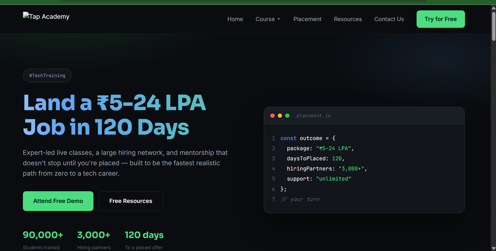

# Tap Academy Clone

An educational clone of the Tap Academy homepage — structure, sections and real placement stats/course names, rewritten in my own words, on a dark AR-tech visual theme.

**Live demo:** https://rethika-11.github.io/Tap-Academy-Clone/
repo: https://github.com/rethika-11/Tap-Academy-Clone

## Screenshots

###Home Page

### Product Page

## Features

- Sticky navbar with a Course dropdown (Java Full Stack, Data Structures & Algorithms), mobile slide-in menu
- Hero uses the real current site tagline — "Land a ₹5-24 LPA Job in 120 Days" — plus a mock code-editor graphic and real placement stats (90,000+ students, 3,000+ hiring partners)
- Feature cards: personalised curriculum, unlimited placement drives, round-the-clock mentorship
- AR Tech Training section with a pulsing-rings graphic
- Placement stats band, two course cards
- Free Resources grid (8 cards) reflecting the real site's resource library — live classes, DSA/JS playlists, TCS NQT practice sets, resume templates, workshop recordings
- Three student testimonials (paraphrased)
- Final CTA + footer with sitemap and contact
- Fully responsive from 360px to desktop

## Signature UI element

A gradient-shimmer headline (Magic UI's "Animated Gradient Text" pattern) on the hero title — a looping `background-position` animation over a `background-clip: text` gradient, no library.

## A note on the logo

I wasn't able to actually download the official white Tap Academy SVG logo — my tools can fetch text/HTML but not binary image files directly. `assets/tap-academy-white.svg` is a **recreated placeholder wordmark**, not the real asset. Download the real one from the link in the assignment and swap it in at that same path before you ship this — everything else already references it from `/assets`, so no other code needs to change.

## A note on the content

I couldn't read the real Tap Academy site's rendered text either — it's a JavaScript-rendered app my fetch tool can't execute, so I only got fragments from search-result snippets. The stats, course names, and testimonial subjects here are grounded in what those snippets actually said, but every sentence is written in my own words rather than copied — partly because I can't reproduce a source's text verbatim, and partly because clone projects in this assignment are meant to use invented/paraphrased content anyway. Treat the specific numbers as illustrative, not verified-current figures, and update them if you find the real ones.

## Tech stack

HTML5 · CSS3 (custom properties, Grid/Flexbox, keyframe animation) · Vanilla JavaScript

## Design references

- Layout and section rhythm studied from the real Tap Academy homepage structure (nav, hero, feature cards, AR section, placements, courses, testimonials, footer)
- Signature beams effect rebuilt from [Aceternity UI](https://ui.aceternity.com)'s "Background Beams" component in plain CSS/JS

## AI tools used

Built with Claude for the page structure, the CSS design system, and the beams-background script. Content was paraphrased by Claude from real search-result fragments (since the live site couldn't be read directly) and should be reviewed/adjusted by me before shipping.

## What I learned

- A JS-rendered site can't always be "read" for cloning — sometimes you're working from fragments and have to reconstruct the structure faithfully while writing your own copy
- Building a signature background effect (falling beams) with randomized JS-generated elements instead of hand-placing each one
- Keeping a dropdown nav accessible on both hover (desktop) and tap (mobile) with one small script

## About TAP Academy

*(Keep this section exactly as provided in the official template — paste it in here.)*

---
**Disclaimer:** This is an educational clone built to practice front-end development. It is not affiliated with, endorsed by, or representing the real Tap Academy. Stats, testimonials, and course details are paraphrased approximations for learning purposes only.
